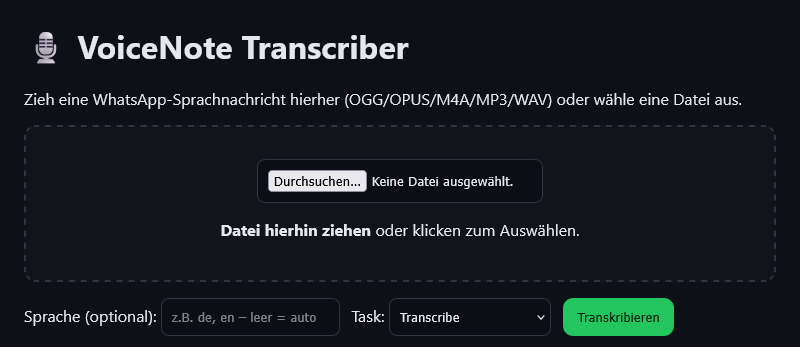

# 🎤 Audio-Transkribieren (WebApp & Android APK)

## Überblick
Dieses Projekt ist eine **selbst entwickelte Anwendung** zur **Audio-Transkription**.  
Die Lösung besteht aus einer **lokal laufenden WebApp** sowie einer **Android WebView-App**, die einen komfortablen mobilen Zugriff bietet.  

👉 **Hinweis:**  
Der Quellcode der WebApp bleibt **privat**, um persönliche Daten zu schützen.  
In diesem Repository findest du daher nur **Screenshots**, eine Projektbeschreibung und die eingesetzten Technologien.

---

## ✨ Features
- **Audioaufnahme & Upload**  
- **Automatische Transkription** (lokale Verarbeitung)  
- **Einfache Weboberfläche**  
- **Android App als mobiler Client**  
- **Proof of Concept für Sprachverarbeitung**  

---

## 🛠️ Technologien
- **Backend/WebApp:** Python (lokaler Server)  
- **Speech-to-Text:** OpenAI Whisper / Alternativen einsetzbar  
- **Deployment:** Debian Server, `systemd`  
- **Mobile Client:** Android (WebView-Wrapper, Kotlin)  

---

## 📸 Screenshot

---

## 🚀 Nutzung
- Die WebApp läuft **lokal im internen Netzwerk** (kein öffentlicher Zugriff).  
- Der Android-Client greift über eine feste IP (z. B. `http://192.168.x.x:5010`) darauf zu.  
- Quellcode wird nicht veröffentlicht – Projekt dient als **Proof of Concept** und **Portfolio-Referenz**.  

---

## 📂 Projektstatus
✅ Funktional im internen Einsatz  
🔒 Quellcode privat (nicht veröffentlicht)  
🖼 Screenshots & Dokumentation dienen als Showcase
